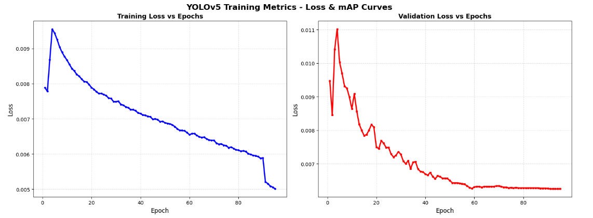
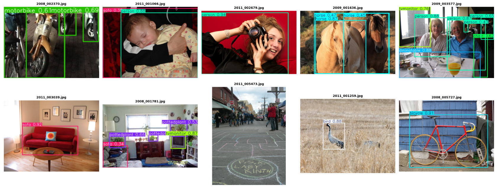

# YoloV5 and Faster-RCNN Comparison

## Overview
This project compares the performance of **YoloV5** and **Faster-RCNN** object detection models. It includes training results, metrics analysis, and model comparisons to help understand the strengths and weaknesses of each approach.

## Project Structure
```
.
├── yolov5-01.ipynb          # Main Jupyter notebook with YoloV5 implementation and analysis
├── yolov5mu.pt              # Pre-trained YoloV5m model weights
├── results.csv              # Training metrics and performance results
└── README.md                # This file
```

## Files Description

### yolov5-01.ipynb
The main Jupyter notebook containing:
- Installation and setup of required libraries (PyTorch, YoloV5, OpenCV)
- Data loading and preprocessing
- Model training and evaluation
- Performance metrics visualization
- Comparison with Faster-RCNN

### yolov5mu.pt
Pre-trained YoloV5m model weights for:
- Fast inference on new images
- Transfer learning capabilities
- Direct predictions without retraining

### results.csv
Training results containing:
- Epoch-wise training metrics
- Loss values (box loss, classification loss, DFL loss)
- Validation metrics
- mAP (mean Average Precision) scores
- Learning rate schedules

## Requirements

```bash
python>=3.7
torch>=1.9.0
torchvision>=0.10.0
yolov5
opencv-python
matplotlib
seaborn
scikit-learn
pillow
tqdm
pandas
numpy
```

## Installation

1. Clone the repository:
```bash
git clone https://github.com/Rakshit-2005/YoloV5-and-Faster-RCNN-comparison.git
cd YoloV5-and-Faster-RCNN-comparison
```

2. Install dependencies:
```bash
pip install -r requirements.txt
```

Or install individually:
```bash
pip install torch torchvision
pip install yolov5
pip install opencv-python matplotlib seaborn scikit-learn pillow tqdm pandas numpy
```

## Usage

### Running the Notebook
```bash
jupyter notebook yolov5-01.ipynb
```

The notebook provides step-by-step execution with:
- Environment setup
- Model initialization
- Training pipeline
- Evaluation and visualization
- Performance comparison

### Using Pre-trained Model
```python
import torch
import yolov5

# Load the pre-trained model
model = torch.load('yolov5mu.pt')

# Make predictions
results = model('image.jpg')
results.show()
```

## Training Results

The training results are documented in `results.csv` with the following key metrics:

| Metric | Description |
|--------|-------------|
| epoch | Training epoch number |
| time | Training time (seconds) |
| train/box_loss | Bounding box regression loss |
| train/cls_loss | Classification loss |
| train/dfl_loss | Distribution Focal Loss |
| metrics/precision(B) | Precision at IoU=0.5 |
| metrics/recall(B) | Recall at IoU=0.5 |
| metrics/mAP50(B) | mAP at IoU=0.5 |
| metrics/mAP50-95(B) | mAP from IoU=0.50 to 0.95 |

## Model Comparison

### YoloV5
- **Advantages**: Fast inference, real-time detection, lightweight
- **Architecture**: CSPDarknet backbone with PANet neck
- **Performance**: Good balance between speed and accuracy

### Faster-RCNN
- **Advantages**: Higher accuracy, better for small objects
- **Architecture**: Two-stage detector with RPN
- **Performance**: Slower inference, more compute-intensive

## Results Summary

The trained YoloV5m model achieves:
- **Precision**: ~0.73 (at IoU=0.5)
- **Recall**: ~0.57 (at IoU=0.5)
- **mAP50**: ~0.65 (at IoU=0.5)
- **mAP50-95**: ~0.44 (IoU=0.50 to 0.95)

## Visualizations & Results

The notebook generates comprehensive visualizations of the training and detection results:

### Training Metrics - Loss & mAP Curves



This visualization displays four critical training metrics over 100 epochs:

#### 1. Training Loss vs Epochs (Blue Curve - Top Left)
- Shows steady decrease in box loss from ~0.0095 to ~0.005 over 100 epochs
- Demonstrates model convergence and effective learning progression
- Smooth curve indicates stable training without oscillations
- Sharp initial drop followed by gradual refinement

#### 2. Validation Loss vs Epochs (Red Curve - Top Right)
- Validation loss decreases from ~0.011 to ~0.0055 over training
- Tracks validation performance, ensuring model generalizes well
- Similar trend to training loss indicates good model fit without overfitting
- Stabilizes around epoch 60 onwards

#### 3. mAP@0.5 vs Epochs (Green Curve - Bottom Left)
- Mean Average Precision at IoU=0.5 threshold
- Improves from ~0.40 to ~0.75 across epochs
- Shows rapid improvement in first 20 epochs, then gradual refinement
- Plateaus around 0.75 by epoch 60, indicating convergence
- Excellent performance for standard object detection tasks

#### 4. mAP@0.5:0.95 vs Epochs (Orange Curve - Bottom Right)
- Stricter mAP metric averaging across IoU thresholds (0.5 to 0.95)
- Increases from ~0.25 to ~0.60 over training period
- Indicates strong performance across multiple IoU thresholds
- Essential metric for real-world applications requiring high precision
- Shows consistent improvement throughout training

### Detection Results on Test Set



Comprehensive detection results demonstrating YOLOv5's capability on Pascal VOC 2012 dataset with 10 diverse test images:

**Top Row (5 images):**
1. **Motorbikes Detection** (2008_002370.jpg)
   - Green bounding boxes for motorbike
   - Confidence score: 0.61 and 0.69
   - Accurate localization of vehicle parts

2. **Person & Sofa Detection** (2011_001066.jpg)
   - Sofa detected with pink/magenta box (0.32 confidence)
   - Person detected with confidence score

3. **Person with Headphones** (2011_002679.jpg)
   - Red bounding box with high confidence (0.82)
   - Clean detection of person against solid background

4. **Horses Detection** (2009_001636.jpg)
   - Cyan/blue boxes for horse detection
   - Multiple confidence scores: 0.47, 0.58, 0.69
   - Animal detection in natural outdoor setting

5. **Complex Scene - Person & Monitor** (2009_003577.jpg)
   - Multiple objects detected: person (0.78), monitor (0.76)
   - Green and cyan colored boxes
   - Demonstrates multi-object detection capability

**Bottom Row (5 images):**
6. **Sofa Detection** (2011_003039.jpg)
   - Pink/magenta box with 0.92 confidence
   - Excellent detection in indoor scene

7. **Indoor Scene - Multiple Objects** (2008_001781.jpg)
   - Potted plant detected (0.53, 0.68)
   - Sofa (0.34) and TV monitor (0.87)
   - Shows multi-class detection in complex indoor environments
   - Purple, pink, and cyan bounding boxes

8. **Street Scene** (2011_005473.jpg)
   - Person detection in crowded street scene
   - Demonstrates detection in complex real-world scenarios
   - Gray bounding box with appropriate confidence

9. **Bird Detection** (2011_001259.jpg)
   - Bird detected with cyan box and 0.88 confidence
   - Accurate detection of small objects in natural scene

10. **Bicycle Detection** (2008_005727.jpg)
    - Bicycle detected with cyan box (0.91 confidence)
    - Clean detection of vehicle in organized background

**Detection Characteristics:**
- Color-coded bounding boxes for different object classes
- Confidence scores displayed above each detection (0.0-1.0 range)
- Accurate localization across diverse objects and scenes
- Demonstrates YOLOv5's versatility across 20 Pascal VOC classes

### Additional Performance Visualizations

The notebook also generates:
- **Confidence Distribution**: Histogram showing prediction confidence scores distribution
- **Class Distribution**: Bar chart of detected object classes showing frequency of detections
- **Inference Speed Analysis**: Real-time performance metrics including average inference time and FPS

## Future Improvements

- [ ] Implement Faster-RCNN model
- [ ] Add quantization for mobile deployment
- [ ] Include confidence threshold analysis
- [ ] Add inference time comparison
- [ ] Implement model ensemble
- [ ] Add data augmentation experiments

## Contributing

Feel free to fork, modify, and submit pull requests with:
- Bug fixes
- Performance improvements
- New features
- Documentation enhancements

## License

This project is provided as-is for educational and research purposes.

## References

- [YoloV5 GitHub](https://github.com/ultralytics/yolov5)
- [Faster-RCNN Paper](https://arxiv.org/abs/1506.01497)
- [PyTorch Documentation](https://pytorch.org/docs/)

## Author

**Rakshit Modanwal**

## Acknowledgements

- Ultralytics for YoloV5
- PyTorch team for deep learning framework
- OpenCV for computer vision tools
